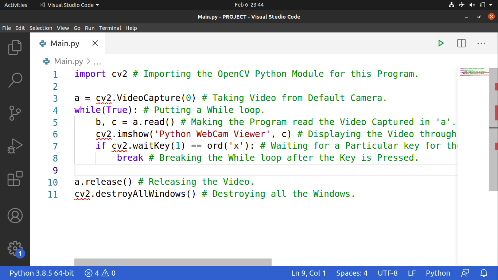

# Python_WebCam_Viewer
This is a Python Program that displays the Video from your Webcam. It uses the Python Module OpenCV for this. If you don't have the OpenCV Module then just type the following in your CMD/Powershell/Terminal (Assuming that you are on Windows):
```
pip install opencv-python
```
Or if you are on Ubuntu (20.04 LTS which I use) then just type the following in your Bash:
```
pip3 install opencv-python
```
Below is the Screenshot of my Program:

And if you wanna see how this Program Works then just refer to the GIF beow to see how this Program Works:

Hope that you liked it.
